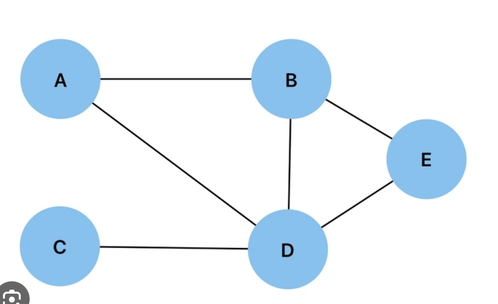
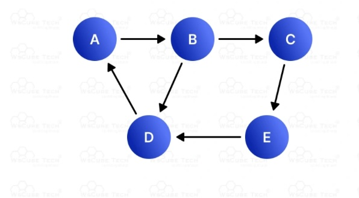

# Week 17 Mon Lab

## Directions

You are going to implement the graph data structure as discussed in lecture using the adjacency matrix strategy. This implementation relies on the `Graph` ADT. For the `GraphMatrix` class, there are 4 methods that you need to implement to complete the data structure. A driver program is already provided. Use this to test your data structure implementation.
### Upload to canvas the adj matrix for the graphs below. ###

## Notes

- This implementation uses a 2D `bool` array called `adjMatrix` to represent edges
    + `false` means no edge, `true` means there is an edge
- In the constructor, parameter 1 is the number of vertices and parameter 2 is the type of graph this is supposed to be
    + Pass the parameters up to the `Graph` constructor, using 0 for the number of edges
    + Allocate memory for `adjMatrix`, remembering this is a dynamic array of dynamic values
    + Ensure all entries in the matrix are initialized to `false`
- In the destructor, release the memory for `adjMatrix`
- The parameters for `isEdge` and `toggleEdge` are vertex numbers and need to be checked for validity

